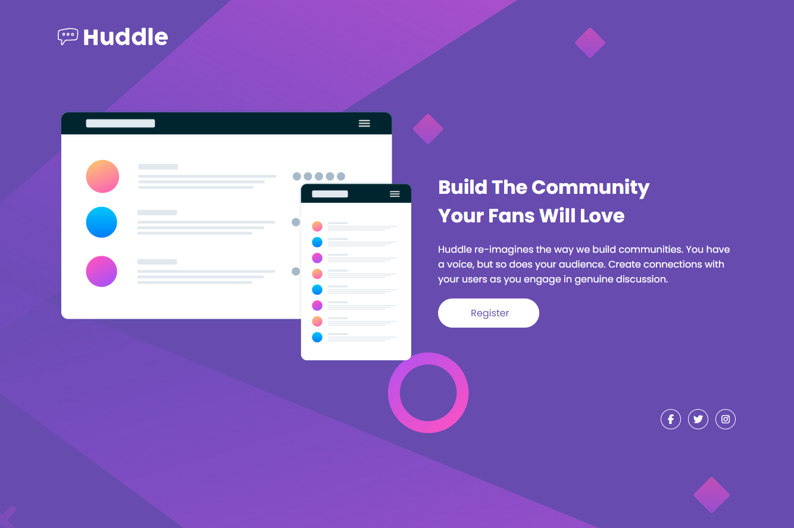
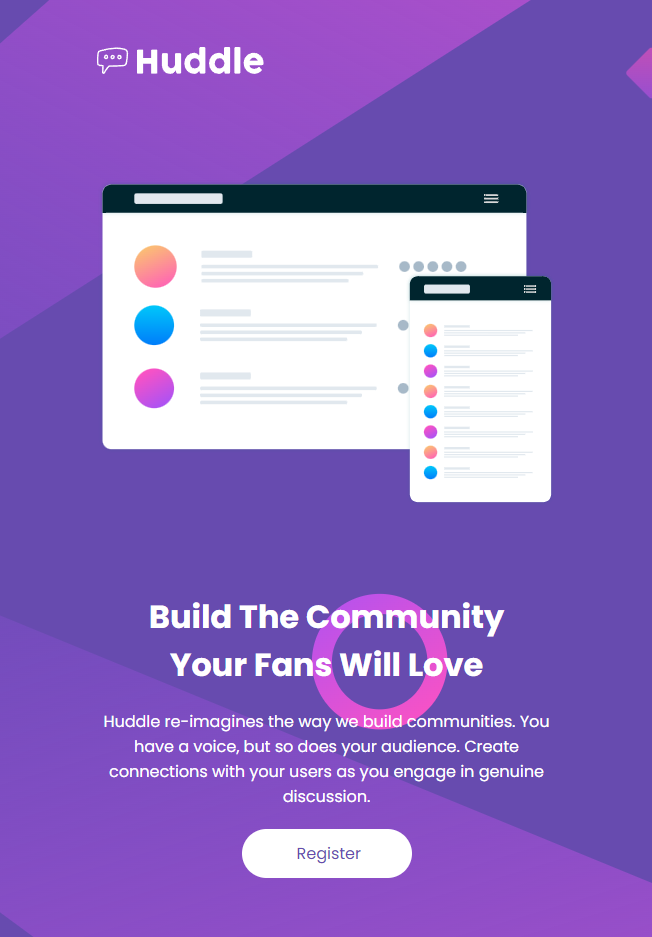

<h1 align="center">
    Frontend Mentor
</h1>
<h2 align="center">
  <a align="center" href="https://devdgato.github.io/landing-page-Frontend-Mentor/" target="_blank" >🔗 See the site 🌐</a>
</h2>


## 📕 About 

**Huddle landing page** with a single introductory section

## Desktop
</img>

## Mobile
</img>

## 🔨 Tools 
- HTML
- CSS

## ♻ How Contribute

```bash
   #Clone the project
   $ git clone https://github.com/devDgato/landing-page-Frontend-Mentor.git
```

```bash
   #Enter directory
   $ cd projeto-huddle-base
```

```bash
   #Install the dependecies, if use npm
   $ npm install
```

<p align="center">Or</p>

```bash
   #Install the dependecies, if use yarn
   $ yarn
```
